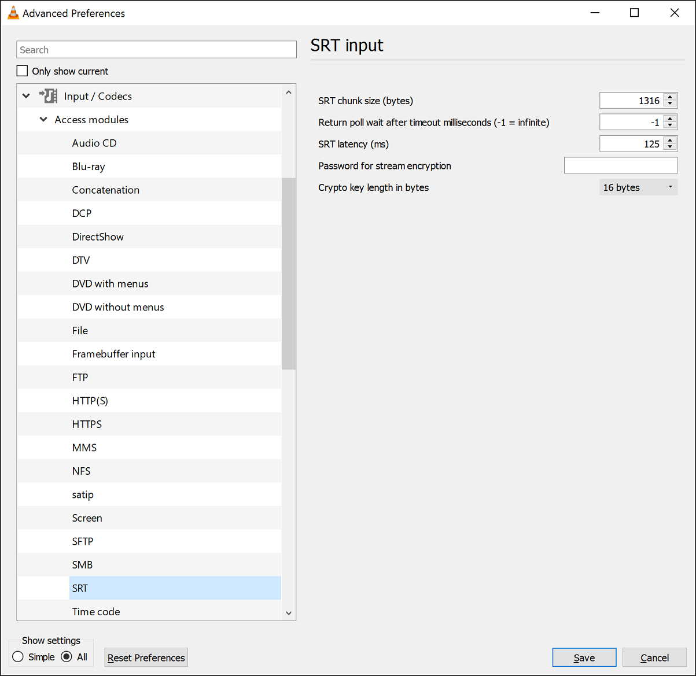

# VLC Media Player

VLC media player supports SRT as an input (starting from VLC version 3 on Mac/Linux, and version 4 on Windows).
_SRT access module source code:_ [_link_](https://fossies.org/linux/vlc/modules/access/srt.c)_._

To open an SRT stream go to the menu "Media" -&gt; "Open Network Stream". Specfy the source URI in the format: `srt://ip:port` .

Note that VLC does not parse URI query options, so the parameters passed in a query are ignored. For example, `srt://ip:port?passphrase=123456789!@` is identical to a simple `srt:ip:port`.

SRT options can be specified on the corresponding property page. Go to the menu "Tools" -&gt; "Preferences". In the bottom-left corner select "Show Settings: All".

Select "SRT" in the tree node of "Input Codecs" -&gt; "Access modules".

