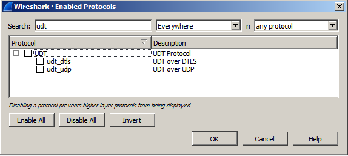

# Using TShark & Wireshark to analyse SRT traffic

Wireshark is a free and open-source packet analyzer. It is a very powerful tools to analyse network traffic, such as a connection.

Since version 3.0 Wireshark supports the SRT protocol and display filters can be applied to find particular elements of a SRT stream easily

*TShark* is a terminal oriented version of  Wireshark designed for capturing and displaying packets when an  interactive user interface isn't necessary or available.

Both tools - TShark and Wireshark with GUI - can be used to create packet captures, which  are helpful to reproduce errors remotely or to feed other analysis tools such as [lib-tcpdump-processing](https://github.com/mbakholdina/lib-tcpdump-processing).

If you only want to capture files and do the analysis on a remote machine, installation of TShark is sufficient. 

## Installation

### Installing TShark & Wireshark on CentOS

TShark on CentOS is part of the CLI-version of Wireshark. To install use following command:

```
sudo yum install wireshark
```

This will install tshark in `/usr/sbin/tshark` 

To install Wireshark with GUI, do the following:

```
sudo yum install wireshark-gnome
```

### Installing TShark & Wireshark on Ubuntu 18.04 LTS

Ubuntu 18.04 only provides Wireshark version 2.6, which has no native SRT support. To install the desired 3.0 or higher version, you could either build Wireshark yourself or follow the instructions from [launchpad](https://launchpad.net/~wireshark-dev/+archive/ubuntu/stable) to get a binary package.

Basically you would add a Personal Package Archive (PPA) to your package repository with following 3 commands. For detailed instructions check the launchpad page at link above.

```
sudo add-apt-repository ppa:wireshark-dev/stable
sudo apt-get update
sudo apt install wireshark tshark
```

To install the GUI version of Wireshark use following command after adding the PPA:

```
sudo apt-get install wireshark-qt
```

### Installing TShark & Wireshark on Ubuntu 19+

Recent versions of Ubuntu serve version 3+ versions of TShark & Wireshark.

```
sudo apt-get update
sudo apt install wireshark tshark
```

To install the GUI version of Wireshark use following command:

```
sudo apt-get install wireshark-qt
```

### Installing TShark & Wireshark on MacOS and Windows

Please download the Wireshark installer for MacOS or Windows directly from the [Wireshark download site](https://www.wireshark.org/#download) and follow the instructions of the installer. TShark installation can be optionally selected (default is on).

## Using TShark to capture network traffic

In order to get best results for further analysis, the network capture should be started before the SRT connection is initiated. So we capture the SRT handshake as well, which can be useful later on.

### Linux & MacOS

Let's assume you are receiving a SRT stream on UDP port 4200 and want to capture it. First you want to make sure, that you are capturing the traffic on the right interface. If your system has multiple network interfaces you could use following command to list all available interfaces: (depending on your settings, you might need root privileges, which can be granted with `sudo`command)

Most Linux systems:

```
sudo ip a
```

MacOS and some Linux systems:

```
sudo ifconfig
```

Once you have identified the interface of your choice run following command: (some systems might need root priviliges to execute packet captures. Use `sudo`command then)

```
tshark -i enp9s0 -f "udp port 4200" -s 1500 -w ./rcv-SRT.pcapng
```

- `-i enp9s0`specifies the interface. Depending on your system this could also be `-i eth0` or  `-i eno1` or whatever the particular interface is named like
- `-f "udp port 4200"` specifies a filter rule to only capture UDP packets on port 4200
- `-s 1500` defines the snapshot length to capture, in this case 1500 bytes per packet
- `-w ./rcv-SRT.pcapng` sets the path and filename in which the captured data is written. In this case in the same directory that you are currently in with the file name `rcv-SRT.pcapng`

### Windows

The procedure on Windows is quite similar, however the naming conventions for the network adapters can be a confusing. 

With following command you can found out IP addresses of your network interfaces:

```
ipconfig /all
```

Note down the name of the `Ethernet adapter` of your choice with the correct IP address that you were looking for. In this example we are looking at `Ethernet adapter Local Area Connection 2:` Now point your shell (Terminal / PowerShell) to the Wireshark directory, which is per default: `c:\Program Files\Wireshark` and execute following command:

```
tshark.exe -D
```

The option `-D` lists all interfaces, unfortunately without IP address. But we already identified the IP with the `ipconfig` command in the prior step. The output would give you something like this:

```
c:\Program Files\Wireshark>tshark.exe -D
1. \Device\NPF_{C4423365-7B46-493C-95E8-2F009A099E0A} (VMware Network Adapter VMnet8)
2. \Device\NPF_{78032B7E-4968-42D3-9F37-287EA86C0AAA} (Local Area Connection* 10)
3. \Device\NPF_{B9A7544E-73D8-4533-BC46-C3A2B99D68BF} (VirtualBox Host-Only Network)
4. \Device\NPF_NdisWanIp (NdisWan Adapter)
5. \Device\NPF_{A0B05D56-015A-4045-832F-E244BC32F9DC} (Local Area Connection)
6. \Device\NPF_NdisWanBh (NdisWan Adapter)
7. \Device\NPF_NdisWanIpv6 (NdisWan Adapter)
8. \Device\NPF_{03564282-7495-4FB5-98A2-CF349E10BE23} (Local Area Connection 2)
9. \Device\NPF_{663F8BBF-7C41-494B-B2BA-269DA97B8B49} (VMware Network Adapter VMnet1)
10. \Device\NPF_{3556DA2E-DEC6-410B-B791-E82CC8ABF216} (Local Area Connection 10)
11. \Device\NPF_Loopback (Adapter for loopback traffic capture)
12. \Device\NPF_{1949D5F2-F562-4C4E-8665-EABC55BFBFFC} (Local Area Connection 4)
13. \Device\NPF_{F4A0A87F-5DB3-42E5-A29E-C061045C1E99} (Local Area Connection 11)
```

The adapter of our choice in this example ( `Ethernet adapter Local Area Connection 2` ) has the `ID 8`.

Finally we can use the `ID 8` to perform the network capture by issuing following command:

```
tshark.exe -i 8 -f "udp port 4200" -s 1500 -w c:\temp\rcv-SRT.pcapng
```

### Best practice tips

- start the capture before starting the SRT transmission

- name the .pcapng files in a way, which gives you a clue later on. For example use `rcv` or `snd` in filename and maybe something like `testrun-1` or other identifiers, which help to understand what you did later on

- on Linux and MacOS you can specify a particular length of time to run the capture with help of `timeout` command. For example use following command to capture 30 seconds of traffic

  ```
  sudo timeout 30 tshark -i enp9s0 -f "udp port 4900" -s 1500 -w ./rcv-SRT.pcapng
  ```

- to stop a capture without `timeout` given just use the keyboard command `CTRL + C`

- timeout on Windows works a bit different. To perform a 30 second capture you can use: 

  ```
  start "" app.exe & timeout /t 30 & taskkill /im app.exe /f
  ```

  for our example this would result in:

  ```
  start "" tshark.exe -i 8 -f "udp port 4200" -s 1500 -w c:\temp\rcv-SRT.pcapng & timeout 30 & taskkill /im tshark.exe /f
  ```

## Analysing the .pcapng capture file

### lib-tcpdump-processing

Specifically for network captures of SRT streams you can use the python scripts out of the library [lib-tcpdump-processing](https://github.com/mbakholdina/lib-tcpdump-processing) provided by Maria Sharabayko. It's a great set of tools to analyse details of an SRT stream and get details quickly. 

Example output of the `get-traffic-stats` script:

```
Overall UDP rate:          7.501 Mbps
SRT Data org+rexmit pld:   7.367 Mbps
SRT Data org payload:      6.665 Mbps
SRT Data overhead:         1.824%
SRT Data missing:          0.000%
SRT Data rexmit overhead:  10.723%
SRT ACK overhead:          0.286%
SRT ACKACK overhead:       0.286%
SRT NAK overhead:          0.162%
===========================================
SRT overall overhead:       11.325%
SRT Data packets (org):     19913
SRT retransmitted:          719 packets (2097 retransmissions)
SRT DATA retransmisions:    10.531% × DATA packets
SRT retransmitted:          3.611% of original packets
    including retransmitted:
    once:    0.015% of original packets
    twice:   0.291% of original packets
    3×:      3.284% of original packets
    4×:      0.020% of original packets
    more:    0.000% of original packets
```

For further documentation and examples please visit the website: [lib-tcpdump-processing](https://github.com/mbakholdina/lib-tcpdump-processing)

### Wireshark GUI

Before you can get started with analysing SRT in the Wireshark GUI, you need to uncheck interpretation of `UDT` packets in Wireshark. To do that, click on `Analyse` in the menu bar on top and select `Enabled Protocols` from the dropdown menu. (keyboard shortcut: `CTRL+SHIFT+E`).

Now search for `UDT` and uncheck the UDT-options which are displayed like shown in picture below.



Now you can import your captured .pcapng file or start a live capture from inside the Wireshark GUI.

A list of possible "display filters" for the SRT protocol can be found at the [Wireshark SRT Display Filter Reference page](https://www.wireshark.org/docs/dfref/s/srt.html).

There are cases when Wireshark will not pass the remainder of the UDP packet to sub-dissectors.
SRT is a sub-dissector of UDP.
This case is in the `decode_udp_ports` function of Wireshark, and has the following comment description:

```
Do lookups with the subdissector table.
We try the port number with the lower value first, followed by the
port number with the higher value.  This means that, for packets
where a dissector is registered for both port numbers:

   1) we pick the same dissector for traffic going in both directions;

   2) we prefer the port number that's more likely to be the right
      one (as that prefers well-known ports to reserved ports);

although there is, of course, no guarantee that any such strategy
will always pick the right port number.

XXX - we ignore port numbers of 0, as some dissectors use a port
number of 0 to disable the port, and as RFC 768 says that the source
port in UDP datagrams is optional and is 0 if not used.
```

:exclamation: Wireshark offers a workaround for this. You have to set the following advanced option:
`Edit -> Preferences -> Advanced: udp.try_heuristic_first = TRUE`.
This will make a UDP packet to be passes to sub-dissectors first.


