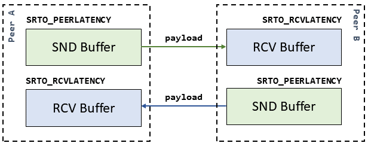

# Latency Negotiation

<link href="https://cdn.jsdelivr.net/npm/bootstrap@5.0.1/dist/css/bootstrap.min.css" rel="stylesheet" integrity="sha384-+0n0xVW2eSR5OomGNYDnhzAbDsOXxcvSN1TPprVMTNDbiYZCxYbOOl7+AMvyTG2x" crossorigin="anonymous">

SRT connection provides a bidirectional transmission channel. Therefore, there are two buffering latencies (delays): one in each direction.
SRT allows to configure both latencies independently using
[`SRTO_RCVLATENCY`](https://github.com/Haivision/srt/blob/v1.4.3/docs/API/API-socket-options.md#SRTO_RCVLATENCY)
and [`SRTO_PEERLATENCY`](https://github.com/Haivision/srt/blob/v1.4.3/docs/API/API-socket-options.md#SRTO_PEERLATENCY)
socket options. For simplicity, [`SRTO_LATENCY`](https://github.com/Haivision/srt/blob/v1.4.3/docs/API/API-socket-options.md#SRTO_LATENCY)
can be used to configure both latencies at once.

!!! Note "Live Streaming Configuration Only"
    Please note that buffering delay is applied only in [Live Streaming configuration](https://datatracker.ietf.org/doc/html/draft-sharabayko-srt-00#section-7.1) whith
    [TSBPD](https://datatracker.ietf.org/doc/html/draft-sharabayko-srt-00#section-4.5) enabled.

Let's assume **Peer A** is the local side on which those socket options are set. **Peer B** is the remote peer with which **Peer A** is establising a connection.
`SRTO_RCVLATENCY` is the buffering delay of the **Peer A** for all the payload it receives.
`SRTO_PEERLATENCY` is the buffering delay of the remote **Peer B** for all the payload it will receive from **Peer A**.
**Peer A** uses this delay when sending the payload to decide if it still makes sense to re-transmit a lost packet (see the [TL Packet Drop](https://datatracker.ietf.org/doc/html/draft-sharabayko-srt-00#section-4.6) Section of SRT RFC).

The same applies relative to **Peer B**. `SRTO_RCVLATENCY` is the latency applied on the incoming payload, `SRTO_PEERLATENCY` is the latency in the direction of sending towards **Peer A**.

!!! Info "Buffering Delay of the Peer"
    `SRTO_PEERLATENCY` is the receiver buffering latency `SRTO_RCVLATENCY` of the peer.

The negotiated latency is the maximum of `SRTO_RCVLATENCY` and `SRTO_PEERLATENCY` pair.  
**Peer A** `SRTO_RCVLATENCY_NEGOTIATED = max(PEER_A_SRTO_RCVLATENCY; PEER_B_SRTO_PEERLATENCY)`. 
**Peer A** `SRTO_PEERLATENCY_NEGOTIATED = max(PEER_A_SRTO_PEERLATENCY; PEER_B_SRTO_RCVLATENCY)`. 
**Peer B** `SRTO_RCVLATENCY_NEGOTIATED = max(PEER_B_SRTO_RCVLATENCY; PEER_A_SRTO_PEERLATENCY)`. 
**Peer B** `SRTO_PEERLATENCY_NEGOTIATED = max(PEER_B_SRTO_PEERLATENCY; PEER_A_SRTO_RCVLATENCY)`.

## Configured Latency (Before Connection)

Set SRT socket options before the connection, and see the negotiated latency after connection is established.

    

        

            <b>Peer A:</b>
        

        

            

                <input type="number" id="RcvLatencyA" class="form-control">
                <label for="RcvLatencyA">SRTO_RCVLATENCY</label>
            

        

        

            

                <input type="number" id="PeerLatencyA" class="form-control">
                <label for="PeerLatencyA">SRTO_PEERLATENCY</label>
            

        

    

    

        

            <b>Peer B:</b>
        

        

            

                <input type="number" id="RcvLatencyB" class="form-control">
                <label for="RcvLatencyB">SRTO_RCVLATENCY</label>
            

        

        

            

                <input type="number" id="PeerLatencyB" class="form-control">
                <label for="PeerLatencyB">SRTO_PEERLATENCY</label>
            

        

    

<button class="btn btn-primary mb-3" id="ResetDefaultBtn">Reset to Defaults</button>

## Negotiated Latency (After Connection)

    

        

            <b>Peer A:</b>
        

        

            

                <input type="number" id="FinalRcvLatencyA" class="form-control sm-2" readonly>
                <label for="FinalRcvLatencyA">SRTO_RCVLATENCY</label>
            

        

        

            

                <input type="number" id="FinalPeerLatencyA" class="form-control" readonly>
                <label for="FinalPeerLatencyA">SRTO_PEERLATENCY</label>
            

        

    

    

        

            <b>Peer B:</b>
        

        

            <input type="number" id="FinalRcvLatencyB" class="form-control" readonly>
        

        

            <input type="number" id="FinalPeerLatencyB" class="form-control" readonly>
        

    

